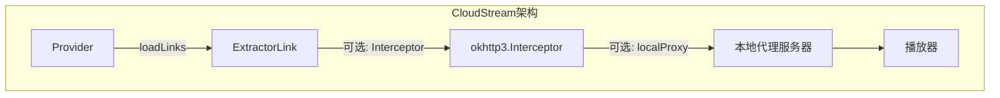
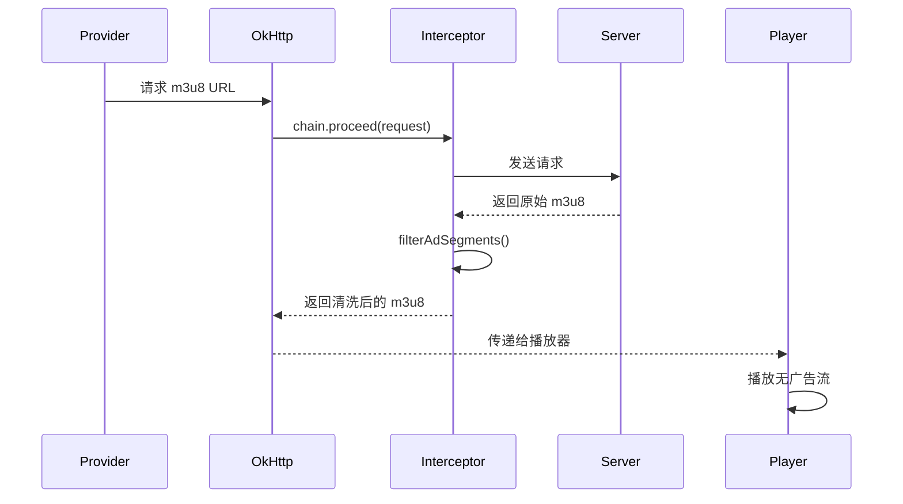
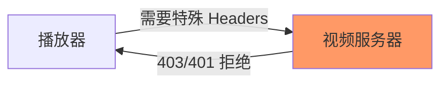
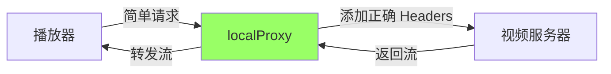
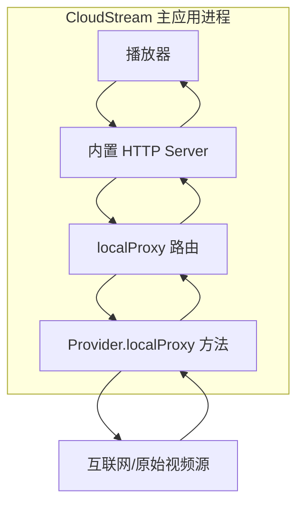

# 广告过滤

基于 CloudStream 过滤 m3u8 中广告 ts 切片的几个可行方案：

## 🎯 方案对比

| 方案 | 难度 | 效果 | 适用场景 |
|------|------|------|---------|
| 1. Provider 层处理 m3u8 | ⭐⭐ | ⭐⭐⭐⭐ | CloudStream 扩展 |
| 2. 本地代理过滤 | ⭐⭐⭐ | ⭐⭐⭐⭐⭐ | 需要实时处理 |
| 3. 预解析重写 m3u8 | ⭐ | ⭐⭐⭐ | 简单场景 |
| 4. 特征识别过滤 | ⭐⭐⭐⭐ | ⭐⭐⭐⭐⭐ | 复杂广告模式 |

---

## 方案 1: Provider 层处理 m3u8（推荐）

在 `loadLinks` 方法中获取并清洗 m3u8，返回干净的播放列表。

### Kotlin 实现（CloudStream 扩展）

```kotlin
override suspend fun loadLinks(
    data: String,
    isCasting: Boolean,
    subtitleCallback: (SubtitleFile) -> Unit,
    callback: (ExtractorLink) -> Unit
): Boolean {
    val m3u8Url = extractM3u8Url(data)
    
    // 获取原始 m3u8
    val originalM3u8 = app.get(m3u8Url).text
    
    // 清洗 m3u8，过滤广告切片
    val cleanedM3u8 = filterAdSegments(originalM3u8)
    
    // 通过本地代理返回清洗后的 m3u8
    val proxyUrl = createProxyUrl(cleanedM3u8)
    
    callback.invoke(
        ExtractorLink(
            source = name,
            name = name,
            url = proxyUrl,
            referer = mainUrl,
            quality = Qualities.Unknown.value,
            isM3u8 = true
        )
    )
    
    return true
}

// 过滤广告切片的核心逻辑
private fun filterAdSegments(m3u8Content: String): String {
    val lines = m3u8Content.lines().toMutableList()
    val filteredLines = mutableListOf<String>()
    
    var i = 0
    while (i < lines.size) {
        val line = lines[i]
        
        // 保留头部信息
        if (line.startsWith("#EXTM3U") || 
            line.startsWith("#EXT-X-VERSION") ||
            line.startsWith("#EXT-X-TARGETDURATION") ||
            line.startsWith("#EXT-X-MEDIA-SEQUENCE")) {
            filteredLines.add(line)
            i++
            continue
        }
        
        // 检测广告标记
        if (line.startsWith("#EXTINF")) {
            val nextLine = lines.getOrNull(i + 1) ?: ""
            
            // 广告识别规则（根据实际情况调整）
            val isAd = when {
                // 规则1: URL 包含 "ad" 或 "advertisement"
                nextLine.contains("ad", ignoreCase = true) -> true
                nextLine.contains("advertisement", ignoreCase = true) -> true
                
                // 规则2: 特定域名的切片
                nextLine.contains("adserver.com") -> true
                nextLine.contains("ads.") -> true
                
                // 规则3: 异常短的切片（通常广告很短）
                line.contains("#EXTINF:") && 
                    extractDuration(line) < 2.0 -> true
                
                // 规则4: 包含 #EXT-X-DISCONTINUITY（广告插播点）
                lines.getOrNull(i - 1)?.contains("#EXT-X-DISCONTINUITY") == true -> true
                
                else -> false
            }
            
            if (!isAd) {
                filteredLines.add(line)
                filteredLines.add(nextLine)
            }
            i += 2
        } else {
            filteredLines.add(line)
            i++
        }
    }
    
    return filteredLines.joinToString("\n")
}

// 提取切片时长
private fun extractDuration(line: String): Double {
    val regex = """#EXTINF:([\d.]+)""".toRegex()
    return regex.find(line)?.groupValues?.get(1)?.toDoubleOrNull() ?: 0.0
}
```


---

## 方案 2: 使用本地代理实时过滤

利用 CloudStream 的 [localProxy] 代理机制。

### CloudStream localProxy

```kotlin
// 在 Provider 中实现本地代理
override fun getVideoInterceptor(extractor: VideoExtractor): Interceptor {
    return Interceptor { chain ->
        val request = chain.request()
        val url = request.url.toString()
        
        if (url.contains(".m3u8")) {
            // 获取并过滤 m3u8
            val response = chain.proceed(request)
            val originalBody = response.body?.string() ?: ""
            val cleanedBody = filterAdSegments(originalBody)
            
            return@Interceptor response.newBuilder()
                .body(cleanedBody.toResponseBody(response.body?.contentType()))
                .build()
        }
        
        chain.proceed(request)
    }
}
```

---

## 方案 3: 高级特征识别

基于机器学习或统计特征识别广告切片。

```python
def is_ad_segment_advanced(self, extinf_line, ts_url, segment_index, all_segments):
    """高级广告检测"""
    
    # 特征1: 时长分布异常
    duration = self.extract_duration(extinf_line)
    avg_duration = self.calculate_average_duration(all_segments)
    if abs(duration - avg_duration) > avg_duration * 0.5:  # 偏差超过50%
        return True
    
    # 特征2: URL 模式突变
    if segment_index > 0:
        prev_url = all_segments[segment_index - 1]['url']
        if self.url_pattern_changed(prev_url, ts_url):
            return True
    
    # 特征3: 文件大小异常（如果可以获取 Content-Length）
    try:
        head = requests.head(ts_url, timeout=2)
        size = int(head.headers.get('Content-Length', 0))
        if size < 10000:  # 小于 10KB，可能是广告
            return True
    except:
        pass
    
    # 特征4: 连续性检查（序号跳跃）
    if self.has_sequence_gap(segment_index, all_segments):
        return True
    
    return False

def url_pattern_changed(self, url1, url2):
    """检测 URL 模式变化"""
    from urllib.parse import urlparse
    
    domain1 = urlparse(url1).netloc
    domain2 = urlparse(url2).netloc
    
    # 域名突然变化，可能是广告
    return domain1 != domain2
```

---

## 方案 4: 使用 #EXT-X-DISCONTINUITY 标记

许多 m3u8 文件会在广告插播点使用 `DISCONTINUITY` 标记。

```python
def filter_by_discontinuity(self, m3u8_content):
    """基于 DISCONTINUITY 标记过滤"""
    lines = m3u8_content.split('\n')
    filtered_lines = []
    
    in_ad_block = False
    discontinuity_count = 0
    
    for i, line in enumerate(lines):
        if '#EXT-X-DISCONTINUITY' in line:
            discontinuity_count += 1
            
            # 奇数次出现：广告开始
            # 偶数次出现：广告结束
            in_ad_block = (discontinuity_count % 2 == 1)
            continue  # 跳过 DISCONTINUITY 标记本身
        
        if not in_ad_block:
            filtered_lines.append(line)
    
    return '\n'.join(filtered_lines)
```

---

## 🎯 实战建议

### 1. **组合多种规则**
```python
def is_ad_segment(self, extinf_line, ts_url, context=None):
    """综合判断"""
    score = 0
    
    # 关键词匹配 (+3分)
    if any(kw in ts_url.lower() for kw in ['ad', 'adv', 'sponsor']):
        score += 3
    
    # 时长异常 (+2分)
    duration = self.extract_duration(extinf_line)
    if duration < 2.0 or duration > 15.0:
        score += 2
    
    # 域名变化 (+2分)
    if context and self.domain_changed(ts_url, context.get('prev_url')):
        score += 2
    
    # DISCONTINUITY 附近 (+1分)
    if context and context.get('near_discontinuity'):
        score += 1
    
    # 阈值判断
    return score >= 3  # 超过3分判定为广告
```

### 2. **缓存处理结果**
```python
from functools import lru_cache

@lru_cache(maxsize=100)
def filter_ad_segments_cached(self, m3u8_hash):
    """缓存过滤结果，避免重复处理"""
    # 处理逻辑...
    pass
```

### 3. **配置化规则**
```python
AD_FILTER_CONFIG = {
    'keywords': ['ad', 'advertisement', 'sponsor'],
    'domains': ['adserver.com', 'ads.example.com'],
    'min_duration': 2.0,
    'max_duration': 15.0,
    'size_threshold': 10000
}
```

---

## CloudStream 网络拦截机制详解



---

## 1. Interceptor 机制（OkHttp 拦截器）

### 概念
`Interceptor` 是 OkHttp 网络库的核心机制，可以在**请求发出前**和**响应返回后**进行拦截和修改。

### CloudStream 中的使用

#### 方式 1: 全局 Interceptor

```kotlin
class MyProvider : MainAPI() {
    override var name = "My Provider"
    override var mainUrl = "https://example.com"
    
    // 返回自定义的 Interceptor
    override fun getVideoInterceptor(extractor: VideoExtractor): Interceptor {
        return M3u8AdFilterInterceptor()
    }
}

// 自定义拦截器
class M3u8AdFilterInterceptor : Interceptor {
    override fun intercept(chain: Interceptor.Chain): Response {
        val request = chain.request()
        val url = request.url.toString()
        
        // 继续请求
        val response = chain.proceed(request)
        
        // 如果是 m3u8 文件，处理内容
        if (url.endsWith(".m3u8") || response.header("Content-Type")?.contains("mpegurl") == true) {
            val originalBody = response.body?.string() ?: return response
            
            // 过滤广告切片
            val cleanedM3u8 = filterAdSegments(originalBody)
            
            // 返回修改后的响应
            return response.newBuilder()
                .body(cleanedM3u8.toResponseBody(response.body?.contentType()))
                .build()
        }
        
        // 其他请求不处理
        return response
    }
    
    private fun filterAdSegments(m3u8Content: String): String {
        val lines = m3u8Content.lines()
        val filtered = mutableListOf<String>()
        
        var i = 0
        while (i < lines.size) {
            val line = lines[i]
            
            // 保留头部
            if (line.startsWith("#EXTM3U") || 
                line.startsWith("#EXT-X-VERSION") ||
                line.startsWith("#EXT-X-TARGETDURATION")) {
                filtered.add(line)
                i++
                continue
            }
            
            // 检测广告
            if (line.startsWith("#EXTINF")) {
                val nextLine = lines.getOrNull(i + 1) ?: ""
                
                // 类似 TVBox 的规则
                val isAd = when {
                    // 规则1: DISCONTINUITY 之间的内容（广告插播）
                    isInDiscontinuityBlock(lines, i) -> true
                    
                    // 规则2: 特定时长的切片
                    matchesDuration(line, listOf("17.99", "14.45", "16.63")) -> true
                    
                    // 规则3: URL 包含特定字符串
                    nextLine.contains("adjump") -> true
                    nextLine.contains("p1ayer") -> true
                    
                    else -> false
                }
                
                if (!isAd) {
                    filtered.add(line)
                    filtered.add(nextLine)
                }
                i += 2
            } else {
                filtered.add(line)
                i++
            }
        }
        
        return filtered.joinToString("\n")
    }
    
    // 检测是否在 DISCONTINUITY 块内
    private fun isInDiscontinuityBlock(lines: List<String>, index: Int): Boolean {
        // 向前查找最近的 DISCONTINUITY
        var firstDisc = -1
        var secondDisc = -1
        
        for (i in (index - 1) downTo 0) {
            if (lines[i].contains("#EXT-X-DISCONTINUITY")) {
                if (secondDisc == -1) secondDisc = i
                else if (firstDisc == -1) {
                    firstDisc = i
                    break
                }
            }
        }
        
        // 如果在两个 DISCONTINUITY 之间，可能是广告
        return secondDisc != -1 && firstDisc != -1 && index > firstDisc && index < secondDisc
    }
    
    // 匹配时长
    private fun matchesDuration(extinf: String, durations: List<String>): Boolean {
        return durations.any { extinf.contains(it) }
    }
}
```

#### 方式 2: 针对特定 Extractor

```kotlin
override suspend fun loadLinks(
    data: String,
    isCasting: Boolean,
    subtitleCallback: (SubtitleFile) -> Unit,
    callback: (ExtractorLink) -> Unit
): Boolean {
    
    // 获取 m3u8 URL
    val m3u8Url = extractM3u8(data)
    
    // 方案A: 直接返回带拦截器的链接
    callback.invoke(
        ExtractorLink(
            source = name,
            name = name,
            url = m3u8Url,
            referer = mainUrl,
            quality = Qualities.Unknown.value,
            isM3u8 = true,
            // 设置拦截器
            extractorData = mapOf("interceptor" to M3u8AdFilterInterceptor())
        )
    )
    
    return true
}
```

### Interceptor 的执行流程



---

## 2. localProxy 机制（本地代理服务器）

### 概念
CloudStream 可以在应用内启动一个**本地 HTTP 代理服务器**，拦截和修改所有经过它的请求。这比 Interceptor 更强大，可以处理任意请求。

### 1. 原始设计意图

[localProxy] 最初的设计目的是解决以下问题：

#### 问题场景


**典型问题**：
- 视频服务器需要特定的 `Referer` 才允许播放
- 需要特定的 `User-Agent`
- 需要动态生成的 `Authorization` token
- 播放器无法直接设置这些复杂的 headers

#### 解决方案


### 2. 核心用途总结

| 用途 | 说明 | 示例 |
|------|------|------|
| **Headers 注入** | 为请求添加必需的 headers | Referer, User-Agent, Cookie |
| **内容过滤** | 过滤 m3u8 广告切片 | 移除 DISCONTINUITY 块 |
| **URL 重写** | 修改视频链接格式 | 相对路径转绝对路径 |
| **内容解密** | 解密加密的播放列表 | AES 解密 |
| **协议转换** | 转换不支持的协议 | RTMP → HLS |

---

### 实现方式

#### 基础代理

```kotlin
class MyProvider : MainAPI() {
    companion object {
        private const val PROXY_HOST = "127.0.0.1"
        private const val PROXY_PORT = 8080
    }
    
    // 启用本地代理
    override val usesWebView = false
    override val supportProxy = true
    
    override suspend fun loadLinks(
        data: String,
        isCasting: Boolean,
        subtitleCallback: (SubtitleFile) -> Unit,
        callback: (ExtractorLink) -> Unit
    ): Boolean {
        val originalM3u8Url = extractM3u8(data)
        
        // 将 m3u8 URL 转换为本地代理 URL
        val proxyUrl = createProxyUrl(originalM3u8Url)
        
        callback.invoke(
            ExtractorLink(
                source = name,
                name = name,
                url = proxyUrl,  // 使用代理 URL
                referer = mainUrl,
                quality = Qualities.Unknown.value,
                isM3u8 = true
            )
        )
        
        return true
    }
    
    // 创建代理 URL
    private fun createProxyUrl(originalUrl: String): String {
        val encodedUrl = URLEncoder.encode(originalUrl, "UTF-8")
        return "http://$PROXY_HOST:$PROXY_PORT/proxy?url=$encodedUrl&provider=${name}"
    }
    
    // 本地代理处理函数
    override fun localProxy(params: Map<String, String>): ProxyResponse {
        val url = params["url"] ?: return ProxyResponse(404, "Not Found")
        val provider = params["provider"]
        
        return when {
            url.endsWith(".m3u8") -> handleM3u8Proxy(url)
            url.endsWith(".ts") -> handleTsProxy(url)
            else -> ProxyResponse(404, "Not Supported")
        }
    }
    
    // 处理 m3u8 代理
    private fun handleM3u8Proxy(url: String): ProxyResponse {
        try {
            // 获取原始 m3u8
            val response = app.get(url)
            val originalContent = response.text
            
            // 过滤广告
            val cleanedContent = filterAdSegments(originalContent)
            
            // 将 ts 链接也转换为代理链接
            val proxiedContent = rewriteTsLinks(cleanedContent, url)
            
            return ProxyResponse(
                code = 200,
                body = proxiedContent.toByteArray(),
                headers = mapOf(
                    "Content-Type" to "application/vnd.apple.mpegurl",
                    "Access-Control-Allow-Origin" to "*"
                )
            )
        } catch (e: Exception) {
            return ProxyResponse(500, "Error: ${e.message}")
        }
    }
    
    // 重写 ts 链接为代理链接
    private fun rewriteTsLinks(m3u8: String, baseUrl: String): String {
        return m3u8.lines().joinToString("\n") { line ->
            if (line.endsWith(".ts") && !line.startsWith("#")) {
                val fullUrl = if (line.startsWith("http")) {
                    line
                } else {
                    URI(baseUrl).resolve(line).toString()
                }
                createProxyUrl(fullUrl)
            } else {
                line
            }
        }
    }
    
    // 处理 ts 切片代理（可选，用于添加 headers）
    private fun handleTsProxy(url: String): ProxyResponse {
        try {
            val response = app.get(url, headers = mapOf(
                "User-Agent" to userAgent,
                "Referer" to mainUrl
            ))
            
            return ProxyResponse(
                code = 200,
                body = response.body?.bytes() ?: byteArrayOf(),
                headers = mapOf(
                    "Content-Type" to "video/mp2t",
                    "Access-Control-Allow-Origin" to "*"
                )
            )
        } catch (e: Exception) {
            return ProxyResponse(500, "Error: ${e.message}")
        }
    }
}

// 代理响应数据类
data class ProxyResponse(
    val code: Int,
    val body: ByteArray = byteArrayOf(),
    val headers: Map<String, String> = emptyMap()
) {
    constructor(code: Int, message: String) : this(
        code, 
        message.toByteArray(),
        mapOf("Content-Type" to "text/plain")
    )
}
```

### 高级用法：结合规则配置

模仿 TVBox 的规则系统：

```kotlin
// 广告过滤规则配置
data class AdFilterRule(
    val name: String,
    val hosts: List<String>,
    val regex: List<String>
)

class AdFilterEngine {
    private val rules = listOf(
        AdFilterRule(
            name = "量子",
            hosts = listOf("vip.lz", "hd.lz", ".cdnlz"),
            regex = listOf(
                "#EXT-X-DISCONTINUITY\\r*\\n*#EXTINF:7\\.166667,[\\s\\S]*?#EXT-X-DISCONTINUITY",
                "#EXT-X-DISCONTINUITY\\r*\\n*#EXTINF:4\\.066667,[\\s\\S]*?#EXT-X-DISCONTINUITY",
                "17.19"
            )
        ),
        AdFilterRule(
            name = "非凡",
            hosts = listOf("vip.ffzy", "hd.ffzy", "super.ffzy"),
            regex = listOf(
                "#EXT-X-DISCONTINUITY\\r*\\n*#EXTINF:6\\.400000,[\\s\\S]*?#EXT-X-DISCONTINUITY",
                "#EXT-X-DISCONTINUITY\\r*\\n*#EXTINF:6\\.666667,[\\s\\S]*?#EXT-X-DISCONTINUITY",
                "#EXTINF.*?\\s+.*?1171(057).*?\\.ts",
                "#EXTINF.*?\\s+.*?6d7b(077).*?\\.ts",
                "17.99",
                "14.45"
            )
        ),
        AdFilterRule(
            name = "暴风",
            hosts = listOf("bfzy", "bfbfvip", "bfengbf"),
            regex = listOf(
                "#EXTINF.*?\\s+.*?adjump.*?\\.ts"
            )
        )
    )
    
    // 根据 URL 匹配规则
    fun getRule(url: String): AdFilterRule? {
        return rules.find { rule ->
            rule.hosts.any { host -> url.contains(host, ignoreCase = true) }
        }
    }
    
    // 应用规则过滤
    fun filterM3u8(content: String, url: String): String {
        val rule = getRule(url) ?: return content
        
        var filtered = content
        
        // 应用所有正则规则
        rule.regex.forEach { pattern ->
            filtered = filtered.replace(Regex(pattern), "")
        }
        
        // 清理空行
        return filtered.lines()
            .filter { it.isNotBlank() }
            .joinToString("\n")
    }
}

// 在 Provider 中使用
class MyProvider : MainAPI() {
    private val adFilter = AdFilterEngine()
    
    private fun filterAdSegments(m3u8: String, url: String): String {
        return adFilter.filterM3u8(m3u8, url)
    }
}
```

---

## 3. Interceptor vs localProxy 对比

| 特性 | Interceptor | localProxy |
|------|------------|-----------|
| **作用范围** | 仅 OkHttp 请求 | 所有 HTTP 请求（包括播放器） |
| **实现复杂度** | ⭐⭐ 简单 | ⭐⭐⭐ 中等 |
| **性能开销** | ⭐ 低 | ⭐⭐ 稍高（本地服务器） |
| **灵活性** | ⭐⭐⭐ 中等 | ⭐⭐⭐⭐⭐ 最高 |
| **适用场景** | 简单过滤 | 复杂处理、重写 URL |
| **是否需要重写 URL** | ❌ 否 | ✅ 是 |

---

## 4. 实战示例：完整的广告过滤 Provider

```kotlin
package com.example

import com.lagradost.cloudstream3.*
import com.lagradost.cloudstream3.utils.*
import okhttp3.Interceptor
import okhttp3.Response
import java.net.URLEncoder

class SeaTVProvider : MainAPI() {
    override var name = "SeaTV"
    override var mainUrl = "https://seatv-24.xyz"
    override val supportedTypes = setOf(TvType.Anime)
    override val hasMainPage = true
    
    // 启用自定义拦截器
    override fun getVideoInterceptor(extractor: VideoExtractor): Interceptor {
        return SeaTVInterceptor()
    }
    
    // ... 其他方法 (search, getMainPage, load) ...
    
    override suspend fun loadLinks(
        data: String,
        isCasting: Boolean,
        subtitleCallback: (SubtitleFile) -> Unit,
        callback: (ExtractorLink) -> Unit
    ): Boolean {
        val document = app.get(data).document
        
        document.select(".mobius option").forEach { option ->
            val base64Val = option.attr("value")
            if (base64Val.isEmpty()) return@forEach
            
            try {
                val decoded = base64Decode(base64Val)
                val iframe = Jsoup.parse(decoded)
                val playUrl = iframe.selectFirst("iframe")?.attr("src") ?: return@forEach
                
                // 返回链接，Interceptor 会自动处理
                callback.invoke(
                    ExtractorLink(
                        source = name,
                        name = name,
                        url = playUrl,
                        referer = mainUrl,
                        quality = Qualities.Unknown.value,
                        isM3u8 = playUrl.contains(".m3u8")
                    )
                )
            } catch (e: Exception) {
                logError(e)
            }
        }
        
        return true
    }
}

// 拦截器实现
class SeaTVInterceptor : Interceptor {
    private val adFilter = AdFilterEngine()
    
    override fun intercept(chain: Interceptor.Chain): Response {
        val request = chain.request()
        val response = chain.proceed(request)
        
        val url = request.url.toString()
        val contentType = response.header("Content-Type") ?: ""
        
        // 只处理 m3u8 文件
        if (!url.endsWith(".m3u8") && !contentType.contains("mpegurl")) {
            return response
        }
        
        try {
            val originalBody = response.body?.string() ?: return response
            val cleanedBody = adFilter.filterM3u8(originalBody, url)
            
            return response.newBuilder()
                .body(cleanedBody.toResponseBody(response.body?.contentType()))
                .build()
        } catch (e: Exception) {
            return response
        }
    }
}
```

---


## 详细说明

### 1. 内置架构

CloudStream 主应用内部已经实现了一个**嵌入式 HTTP 服务器**，运行在 Android 应用进程内。



### 2. Provider 只需重写方法

作为扩展开发者，你只需在 Provider 类中重写 [localProxy] 方法：

```kotlin
class MyProvider : MainAPI() {
    // ... 其他方法 ...
    
    /**
     * 这个方法会被 CloudStream 内置的 HTTP 服务器调用
     * 你不需要自己启动服务器！
     */
    override fun localProxy(params: Map<String, String>): ByteArray? {
        val url = params["url"] ?: return null
        val type = params["type"] ?: ""
        
        when (type) {
            "m3u8" -> {
                // 处理 m3u8 请求
                val content = app.get(url).text
                val cleaned = filterAdSegments(content)
                return cleaned.toByteArray()
            }
            "ts" -> {
                // 处理 ts 切片请求
                val bytes = app.get(url).body?.bytes()
                return bytes
            }
            else -> return null
        }
    }
}
```

### 3. 工作流程

```kotlin
// Step 1: Provider 在 loadLinks 中返回本地代理 URL
override suspend fun loadLinks(...): Boolean {
    val originalUrl = "https://example.com/video.m3u8"
    
    // 构造本地代理 URL（CloudStream 会自动路由到你的 localProxy 方法）
    val proxyUrl = "http://127.0.0.1:${getProxyPort()}/proxy?url=${encode(originalUrl)}&type=m3u8"
    
    callback.invoke(
        ExtractorLink(
            source = name,
            name = name,
            url = proxyUrl,  // 播放器会请求这个本地地址
            ...
        )
    )
    
    return true
}

// Step 2: 播放器请求 proxyUrl 时，CloudStream 自动调用你的 localProxy 方法
override fun localProxy(params: Map<String, String>): ByteArray? {
    // params["url"] = "https://example.com/video.m3u8"
    // params["type"] = "m3u8"
    
    // 你的处理逻辑...
    return processedData
}
```

---

## 实际 API 设计（根据源码推断）

CloudStream 的实际实现可能类似这样：

### CloudStream 内置服务器（主应用）

```kotlin
// 这是 CloudStream 主应用的代码，你不需要写
class InternalProxyServer {
    private val server = NanoHTTPD(8080)  // 或其他轻量级 HTTP 服务器
    
    fun start() {
        server.start()
    }
    
    fun handleRequest(uri: String, params: Map<String, String>): Response {
        // 解析请求，找到对应的 Provider
        val providerName = params["provider"]
        val provider = getProvider(providerName)
        
        // 调用 Provider 的 localProxy 方法
        val result = provider?.localProxy(params)
        
        return if (result != null) {
            Response(Status.OK, "application/octet-stream", result)
        } else {
            Response(Status.NOT_FOUND, "text/plain", "Not found")
        }
    }
}
```

### 你的 Provider 扩展

```kotlin
// 这是你需要写的代码 - 非常简单！
class MyProvider : MainAPI() {
    override fun localProxy(params: Map<String, String>): ByteArray? {
        // 你的处理逻辑
        val url = params["url"] ?: return null
        val response = app.get(url)
        
        // 过滤广告
        val cleaned = filterContent(response.text)
        return cleaned.toByteArray()
    }
}
```

---

## 完整示例：带广告过滤的 Provider

```kotlin
package com.example

import com.lagradost.cloudstream3.*
import com.lagradost.cloudstream3.utils.*
import java.net.URLEncoder

class SeaTVProvider : MainAPI() {
    override var name = "SeaTV"
    override var mainUrl = "https://seatv-24.xyz"
    override val supportedTypes = setOf(TvType.Anime)
    
    companion object {
        // CloudStream 内置代理端口（通常是固定的）
        private const val PROXY_PORT = 8080
    }
    
    // 广告过滤规则
    private val adRules = mapOf(
        "vip.ffzy" to listOf("17.99", "14.45"),
        "vip.lz" to listOf("17.19"),
        "bfzy" to listOf("adjump")
    )
    
    override suspend fun loadLinks(
        data: String,
        isCasting: Boolean,
        subtitleCallback: (SubtitleFile) -> Unit,
        callback: (ExtractorLink) -> Unit
    ): Boolean {
        val document = app.get(data).document
        
        document.select(".mobius option").forEach { option ->
            val base64Val = option.attr("value")
            if (base64Val.isEmpty()) return@forEach
            
            try {
                val decoded = base64Decode(base64Val)
                val iframe = Jsoup.parse(decoded)
                val playUrl = iframe.selectFirst("iframe")?.attr("src") ?: return@forEach
                
                // 判断是否需要通过代理过滤
                val needsProxy = playUrl.contains(".m3u8") && shouldFilter(playUrl)
                
                val finalUrl = if (needsProxy) {
                    // 使用本地代理（CloudStream 会自动路由到 localProxy 方法）
                    buildProxyUrl(playUrl)
                } else {
                    playUrl
                }
                
                callback.invoke(
                    ExtractorLink(
                        source = name,
                        name = name,
                        url = finalUrl,
                        referer = mainUrl,
                        quality = Qualities.Unknown.value,
                        isM3u8 = playUrl.contains(".m3u8")
                    )
                )
            } catch (e: Exception) {
                logError(e)
            }
        }
        
        return true
    }
    
    // 构建代理 URL
    private fun buildProxyUrl(originalUrl: String): String {
        val encoded = URLEncoder.encode(originalUrl, "UTF-8")
        return "http://127.0.0.1:$PROXY_PORT/localProxy?url=$encoded&provider=$name"
    }
    
    // 判断是否需要过滤
    private fun shouldFilter(url: String): Boolean {
        return adRules.keys.any { url.contains(it) }
    }
    
    /**
     * 本地代理处理方法
     * CloudStream 内置服务器会调用这个方法
     */
    override fun localProxy(params: Map<String, String>): ByteArray? {
        val url = params["url"] ?: return null
        
        return try {
            if (url.endsWith(".m3u8")) {
                // 处理 m3u8 文件
                handleM3u8Proxy(url)
            } else if (url.endsWith(".ts")) {
                // 处理 ts 切片（可选，通常用于添加 headers）
                handleTsProxy(url)
            } else {
                null
            }
        } catch (e: Exception) {
            logError(e)
            null
        }
    }
    
    // 处理 m3u8 代理
    private fun handleM3u8Proxy(url: String): ByteArray {
        // 获取原始 m3u8
        val response = app.get(url)
        val original = response.text
        
        // 过滤广告
        val cleaned = filterAdSegments(original, url)
        
        // 重写 ts 链接为代理链接（如果 ts 也需要代理）
        val rewritten = rewriteTsUrls(cleaned, url)
        
        return rewritten.toByteArray()
    }
    
    // 过滤广告切片
    private fun filterAdSegments(m3u8: String, url: String): String {
        // 找到匹配的规则
        val rule = adRules.entries.find { url.contains(it.key) } ?: return m3u8
        
        val lines = m3u8.lines()
        val filtered = mutableListOf<String>()
        
        var i = 0
        while (i < lines.size) {
            val line = lines[i]
            
            if (line.startsWith("#EXTINF")) {
                val nextLine = lines.getOrNull(i + 1) ?: ""
                
                // 检测是否匹配广告规则
                val isAd = rule.value.any { pattern ->
                    line.contains(pattern) || nextLine.contains(pattern)
                }
                
                if (!isAd) {
                    filtered.add(line)
                    filtered.add(nextLine)
                }
                i += 2
            } else {
                filtered.add(line)
                i++
            }
        }
        
        return filtered.joinToString("\n")
    }
    
    // 重写 ts URL 为代理 URL
    private fun rewriteTsUrls(m3u8: String, baseUrl: String): String {
        return m3u8.lines().joinToString("\n") { line ->
            if (line.endsWith(".ts") && !line.startsWith("#")) {
                val fullUrl = if (line.startsWith("http")) {
                    line
                } else {
                    resolveUrl(baseUrl, line)
                }
                buildProxyUrl(fullUrl)
            } else {
                line
            }
        }
    }
    
    // 处理 ts 切片代理
    private fun handleTsProxy(url: String): ByteArray {
        val response = app.get(url, headers = mapOf(
            "User-Agent" to "Mozilla/5.0 ...",
            "Referer" to mainUrl
        ))
        return response.body?.bytes() ?: byteArrayOf()
    }
}
```

---

## 关键要点总结

- 重写 [localProxy(params: Map<String, String>): ByteArray?] 方法
- 在 `loadLinks` 中构造本地代理 URL
- 实现你的内容处理逻辑（过滤、重写等）

---
