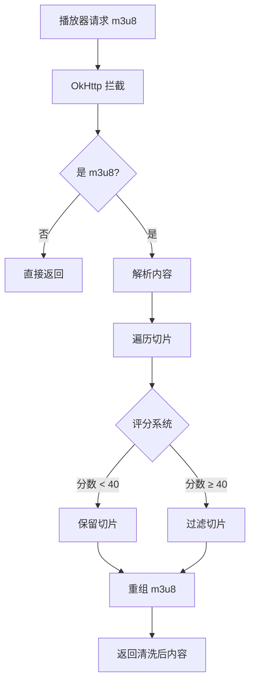

# AdFilterInterceptor 广告过滤器使用文档

## 📋 概述

`AdFilterInterceptor` 是一个强大的 M3U8 广告过滤拦截器，用于 CloudStream 扩展。它结合了 TVBox 的规则匹配和智能特征识别，能够自动过滤视频流中的广告切片。

## 🎯 核心功能

### 1. TVBox 规则匹配
基于多个 TVBox 配置整理的广告过滤规则，支持以下资源站：
- 暴风资源 (bfzy)
- 量子资源 (lz)
- 非凡资源 (ffzy)
- 索尼资源 (suonizy)
- 快看资源 (kuaikan)
- 乐视云 (leshiyuncdn)
- 1080 资源
- 555 电影
- 海外看 (haiwaikan)
- 星星资源
- 奇虎资源 (qihubf)
- U酷资源 (ukzy)
- ikun 资源
- 卧龙资源

### 2. 智能特征识别
自动检测以下异常特征：
- ✅ **时长异常**：广告切片通常有固定的时长特征
- ✅ **域名突变**：广告切片可能来自不同的域名
- ✅ **序号跳跃**：广告插播会导致切片序号不连续
- ✅ **文件名模式**：广告切片有特定的命名模式
- ✅ **DISCONTINUITY 检测**：识别广告插播点
- ✅ **关键词匹配**：识别包含广告关键词的 URL

## 📖 规则说明

### 规则类型

#### 1. 时长匹配规则
广告切片通常有固定的时长，例如：
```
"15.92"  → 乐视云广告时长：15.92 秒
"17.99"  → 非凡广告时长：17.99 秒
"14.45"  → 非凡广告时长：14.45 秒
"17.19"  → 量子广告时长：17.19 秒
```

在 m3u8 文件中体现为：
```
#EXTINF:15.92,
http://leshiyuncdn.com/ad_segment.ts  ← 匹配到 15.92 秒，判定为广告
```

#### 2. DISCONTINUITY 模式
广告插播通常在两个 `#EXT-X-DISCONTINUITY` 标签之间：
```
#EXT-X-DISCONTINUITY
#EXTINF:6.4,
http://vip.ffzy.com/ad_12345.ts  ← 广告切片
#EXT-X-DISCONTINUITY
#EXTINF:10.0,
http://vip.ffzy.com/video_001.ts  ← 正常内容
```

#### 3. URL 模式匹配
特定的文件名或路径模式：
```
adjump.*\.ts       → 暴风广告文件名包含 "adjump"
p1ayer.*\.ts       → 索尼广告文件名包含 "p1ayer"（混淆的 player）
1171057.*\.ts      → 非凡广告特定哈希
```

#### 4. 加密方式切换
某些资源站的广告使用：
```
#EXT-X-KEY:METHOD=NONE    ← 广告不加密
#EXTINF:2.4,
ad_segment.ts
#EXT-X-DISCONTINUITY
#EXT-X-KEY:METHOD=AES-128 ← 正常内容加密
```

## 🚀 使用方法

### 方式 1: 自动启用（推荐）

如果你的 Provider 继承自 `BaseVodProvider`，广告过滤器会**自动启用**，无需任何额外代码：

```kotlin
class BfzyProvider : BaseVodProvider() {
    override var mainUrl = "https://bfzyapi.com"
    override var name = "暴风资源"
    
    // 无需任何额外代码，AdFilterInterceptor 已自动启用！
}
```

### 方式 2: 自定义启用

如果你的 Provider 直接继承 `MainAPI`，需要手动添加拦截器：

```kotlin
class MyProvider : MainAPI() {
    override var name = "My Provider"
    override var mainUrl = "https://example.com"
    
    // 重写此方法以启用广告过滤
    override fun getVideoInterceptor(extractorLink: ExtractorLink): Interceptor {
        return AdFilterInterceptor()
    }
    
    // ... 其他方法 ...
}
```

### 方式 3: 扩展自定义规则

如果需要添加自己的规则，可以创建自定义拦截器：

```kotlin
class CustomAdFilterInterceptor : AdFilterInterceptor() {
    // 可以重写方法来添加自定义逻辑
    override fun intercept(chain: Interceptor.Chain): Response {
        // 调用父类的过滤逻辑
        return super.intercept(chain)
    }
}
```

## 🔍 工作原理

### 评分机制

过滤器使用**评分系统**综合判断切片是否为广告：

| 检测项 | 分数 | 说明 |
|--------|------|------|
| TVBox 正则匹配 | +50 | 匹配到配置的规则 |
| DISCONTINUITY 块 | +30 | 在广告插播块内 |
| 时长异常 | +20 | 与平均时长偏差 >50% |
| URL 关键词 | +40 | 包含 ad、adjump 等 |
| 域名突变 | +25 | 域名与前一个不同 |
| 文件名模式异常 | +15 | 匹配广告文件名模式 |
| 序号跳跃 | +10 | 切片序号不连续 |

**阈值：分数 ≥ 40 判定为广告**

### 处理流程



## 📊 统计与调试

### 启用调试日志

在 `AdFilterInterceptor.kt` 中设置：
```kotlin
companion object {
    private const val DEBUG = true  // 启用调试日志
}
```

### 日志输出示例

```
D/AdFilterInterceptor: Processing m3u8: https://vip.ffzy.com/20240106/xxx/index.m3u8
D/AdFilterInterceptor: Original lines: 245
D/AdFilterInterceptor: Regex match for: segment_1171057.ts
D/AdFilterInterceptor: AD DETECTED (score: 50): segment_1171057.ts
D/AdFilterInterceptor: Duration abnormal: 6.4 vs avg 10.2
D/AdFilterInterceptor: AD DETECTED (score: 70): ad_segment.ts
D/AdFilterInterceptor: Filtered 12 lines from m3u8
```

## 🧪 测试指南

### 1. 手动测试

使用 Android Studio 的 Logcat 查看过滤效果：
```bash
# 过滤 AdFilterInterceptor 日志
adb logcat | grep AdFilterInterceptor
```

### 2. 对比测试

**测试前（未启用过滤器）**：
- 播放视频，观察是否有广告
- 记录广告出现的位置和时长

**测试后（启用过滤器）**：
- 播放相同视频
- 检查广告是否被过滤
- 查看日志确认过滤了多少切片

### 3. 效果验证

**成功标志**：
- ✅ 视频中不再出现广告
- ✅ 日志显示 "Filtered X lines from m3u8"
- ✅ 播放流畅，无卡顿

**可能的问题**：
- ❌ 正常内容被误过滤 → 需要调整阈值或规则
- ❌ 广告未被过滤 → 需要添加新规则

## 📝 规则贡献指南

如果你发现新的广告模式，可以按以下步骤添加规则：

### 1. 分析广告特征

下载 m3u8 文件并分析：
```bash
# 下载 m3u8 文件
curl -o playlist.m3u8 "https://example.com/video.m3u8"

# 查看内容
cat playlist.m3u8
```

查找广告切片的特征：
- 固定的时长
- 特殊的文件名模式
- DISCONTINUITY 标记
- 域名变化

### 2. 测试正则表达式

使用在线工具测试正则：
- [Regex101](https://regex101.com/)
- 选择 "ECMAScript (JavaScript)" flavor

### 3. 添加规则

在 `AD_FILTER_RULES` 中添加新规则：
```kotlin
AdFilterRule(
    name = "新资源站",
    hosts = listOf("example.com", "cdn.example.com"),
    regex = listOf(
        // 时长匹配
        """15\.92""",
        // DISCONTINUITY 块
        """#EXT-X-DISCONTINUITY\r*\n*#EXTINF:6\.4,[\s\S]*?#EXT-X-DISCONTINUITY""",
        // 文件名模式
        """#EXTINF.*?\s+.*?ad.*?\.ts"""
    )
)
```

### 4. 测试验证

编译并测试新规则是否有效。

## ⚙️ 高级配置

### 调整过滤阈值

如果发现误过滤或漏过滤，可以调整阈值：

```kotlin
// 在 isAdSegment 方法中
val isAd = adScore >= 40  // 默认阈值
// 调整为 50 会更严格，减少误过滤
// 调整为 30 会更宽松，过滤更多疑似广告
```

### 禁用特定检测

如果某项检测导致问题，可以注释掉：

```kotlin
// === 规则4: URL 关键词检测 ===
// if (containsAdKeywords(tsUrl)) {
//     adScore += 40
// }
```

### 自定义关键词

在 `containsAdKeywords` 方法中添加：

```kotlin
val adKeywords = listOf(
    "ad", "ads", "advertisement",
    // 添加你发现的新关键词
    "promo", "banner", "popup"
)
```

## 🔧 故障排除

### 问题 1: 正常内容被过滤

**症状**：播放时部分正常内容丢失

**解决方案**：
1. 检查日志，查看哪些切片被误判
2. 调高过滤阈值（如从 40 改为 50）
3. 关闭某些误判率高的检测规则

### 问题 2: 广告未被过滤

**症状**：仍然看到广告

**解决方案**：
1. 下载 m3u8 文件分析广告特征
2. 添加新的过滤规则
3. 调低过滤阈值（谨慎使用）

### 问题 3: 性能问题

**症状**：播放卡顿或加载慢

**解决方案**：
1. 设置 `DEBUG = false` 减少日志输出
2. 简化复杂的正则表达式
3. 减少规则数量（只保留常用资源站）

## 📚 参考资源

- [CloudStream 官方文档](https://recloudstream.github.io/csdocs/)
- [m3u8 格式规范](https://tools.ietf.org/html/rfc8216)
- [OkHttp Interceptor 文档](https://square.github.io/okhttp/interceptors/)

---

**最后更新**：2026-01-06  
**版本**：1.0.0
