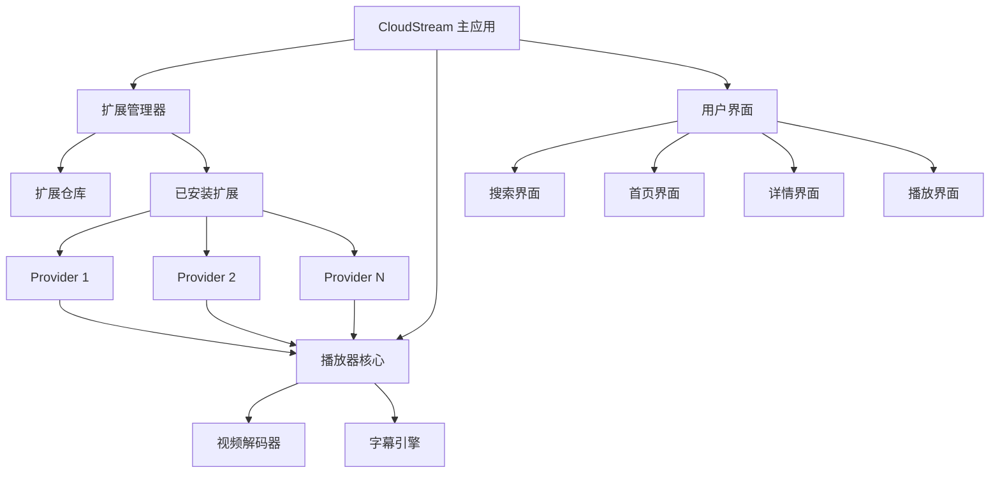
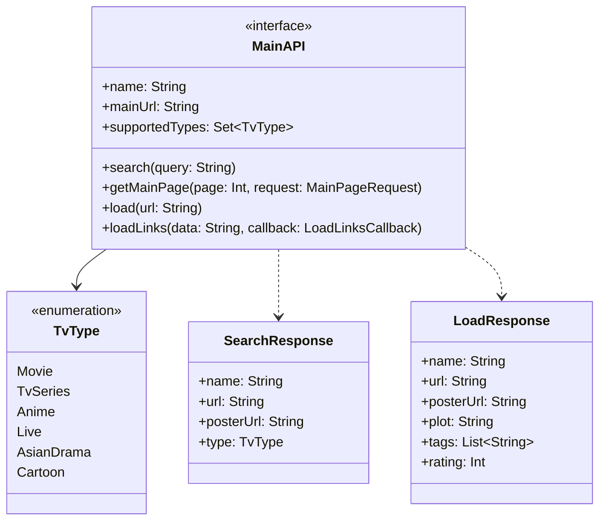
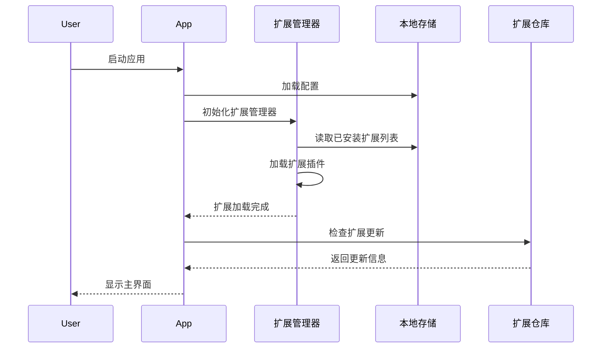
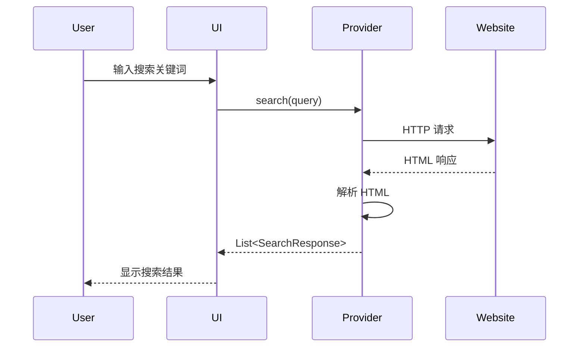
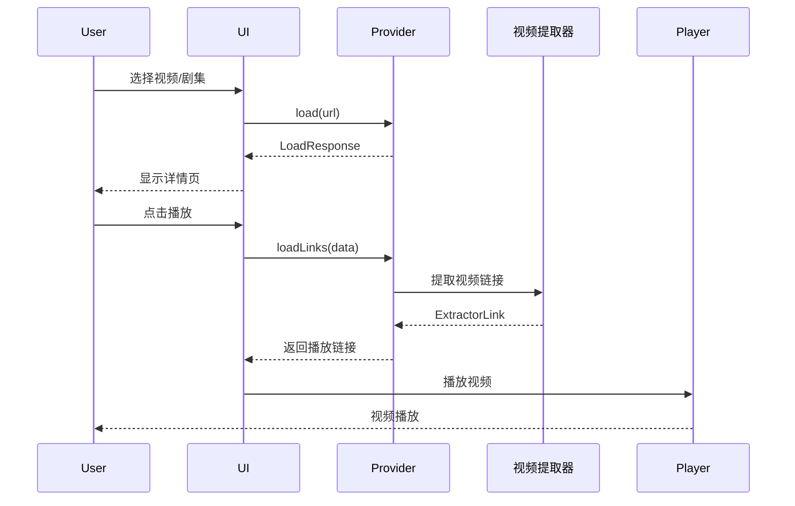

# CloudStream 项目深度分析报告

## 项目概述

CloudStream 是一个开源的 Android 媒体播放应用，专注于为用户和开发者提供完全的自由和灵活性。它采用基于扩展的架构设计，通过社区开发的插件来提供各种媒体内容源的访问能力。

### 基本信息

- **项目名称**: CloudStream
- **开发语言**: Kotlin
- **平台**: Android
- **开源协议**: 见 [GitHub 仓库](https://github.com/recloudstream/cloudstream)
- **官方文档**: [https://recloudstream.github.io/csdocs/](https://recloudstream.github.io/csdocs/)
- **官方仓库**: [https://github.com/recloudstream/cloudstream](https://github.com/recloudstream/cloudstream)

### 核心特性

- **无广告**: 完全去除广告干扰
- **无追踪**: 不包含任何追踪或分析功能
- **书签功能**: 支持收藏和管理媒体内容
- **多设备支持**: 支持手机和电视设备
- **Chromecast**: 支持投屏功能
- **扩展系统**: 完全可定制的插件扩展机制

---

## 技术架构

### 整体架构设计

CloudStream 采用了模块化的架构设计，核心应用本身不提供任何视频源，所有内容源都通过扩展插件提供。这种设计带来以下优势：

1. **解耦合**: 核心应用与内容源完全分离
2. **灵活性**: 用户可以自由选择安装需要的扩展
3. **可维护性**: 每个扩展独立开发和维护
4. **合规性**: 核心应用不涉及任何版权内容

### 核心组件



### 技术栈

- **编程语言**: Kotlin
- **构建工具**: Gradle
- **UI 框架**: Android SDK
- **网络请求**: 基于 OkHttp/Retrofit
- **HTML 解析**: JSoup
- **JSON 解析**: Jackson
- **异步处理**: Kotlin Coroutines

---

## 插件系统设计

### 插件架构

CloudStream 的插件系统是其核心特性，所有扩展都基于统一的 Provider API 开发。

#### Provider 接口层次



### Provider 四大核心功能

CloudStream 的 Provider 主要由四个核心功能组成：

#### 1. 搜索功能 (Search)

**功能描述**: 根据用户输入的关键词，返回匹配的媒体内容列表。

**方法签名**:
```kotlin
override suspend fun search(query: String): List<SearchResponse>
```

**实现示例**:
```kotlin
override suspend fun search(query: String): List<SearchResponse> {
    return app.post(
        mainUrl,
        data = mapOf("search" to query)
    ).document
    .select("div.card-body")
    .mapNotNull { element ->
        element.toSearchResponse()
    }
}

private fun Element.toSearchResponse(): SearchResponse? {
    val link = this.select("div.alternative a").last() ?: return null
    val href = fixUrl(link.attr("href"))
    val img = this.selectFirst("div.thumb img")
    val title = img?.attr("alt") ?: return null
    val posterUrl = img.attr("src")
    
    return newAnimeSearchResponse(title, href) {
        this.posterUrl = posterUrl
    }
}
```

**核心流程**:
1. 发送搜索请求到目标网站
2. 解析 HTML 响应
3. 提取搜索结果元素
4. 转换为 `SearchResponse` 对象列表

---

#### 2. 首页内容 (Home Page)

**功能描述**: 展示分类内容列表，支持无限滚动加载。

**配置定义**:
```kotlin
override val mainPage = mainPageOf(
    Pair("1", "Recent Release - Sub"),
    Pair("2", "Recent Release - Dub"),
    Pair("3", "Recent Release - Chinese")
)
```

**方法签名**:
```kotlin
override suspend fun getMainPage(
    page: Int,
    request: MainPageRequest
): HomePageResponse
```

**实现示例**:
```kotlin
override suspend fun getMainPage(
    page: Int,
    request: MainPageRequest
): HomePageResponse {
    val params = mapOf(
        "page" to page.toString(),
        "type" to request.data
    )
    
    val html = app.get(
        "$mainUrl/ajax/page-recent-release.html",
        params = params
    )
    
    val home = html.document
        .select("div.film-item")
        .mapNotNull { it.toSearchResponse() }
    
    return newHomePageResponse(request.name, home)
}
```

**设计特点**:
- 支持多个分类标签
- 分页加载机制
- 可复用搜索结果转换逻辑

---

#### 3. 详情页面 (Load Details)

**功能描述**: 加载媒体的详细信息，包括元数据和剧集列表。

**方法签名**:
```kotlin
override suspend fun load(url: String): LoadResponse
```

**实现示例**:
```kotlin
override suspend fun load(url: String): LoadResponse {
    val document = app.get(url).document
    
    // 提取元数据
    val title = document.selectFirst("h1.entry-title")?.text() ?: ""
    val posterUrl = document.selectFirst("div.ime > img")?.attr("data-src") ?: ""
    val plot = document.selectFirst("div.entry-content")?.text() ?: ""
    val rating = document.selectFirst(".imdb")?.text()?.toRatingInt()
    
    // 判断是电影还是剧集
    val isMovie = document.selectFirst(".spe")?.text()?.contains("Movie") == true
    
    if (isMovie) {
        // 电影处理
        val playUrl = document.selectFirst(".eplister li > a")?.attr("href") ?: ""
        
        return newMovieLoadResponse(title, url, TvType.Movie, playUrl) {
            this.posterUrl = posterUrl
            this.plot = plot
            this.rating = rating
        }
    } else {
        // 剧集处理 - 获取所有集数
        val episodes = mutableListOf<Episode>()
        val epPageUrl = document.selectFirst(".eplister li > a")?.attr("href") ?: ""
        
        val epDoc = app.get(epPageUrl).document
        epDoc.select("div.episodelist > ul > li").forEach { ep ->
            val epLink = ep.selectFirst("a")?.attr("href") ?: return@forEach
            val epName = ep.selectFirst("a span")?.text() ?: ""
            
            episodes.add(
                Episode(epLink, epName)
            )
        }
        
        return newTvSeriesLoadResponse(title, url, TvType.TvSeries, episodes.reversed()) {
            this.posterUrl = posterUrl
            this.plot = plot
            this.rating = rating
        }
    }
}
```

**核心任务**:
- 提取媒体标题、海报、简介等元数据
- 判断内容类型（电影/剧集）
- 对于剧集，需获取完整的剧集列表
- 支持评分、标签、演员等额外信息

---

#### 4. 视频链接解析 (Load Links)

**功能描述**: 从播放页面提取实际的视频播放地址，这是最具挑战性的部分。

**方法签名**:
```kotlin
override suspend fun loadLinks(
    data: String,
    isCasting: Boolean,
    subtitleCallback: (SubtitleFile) -> Unit,
    callback: (ExtractorLink) -> Unit
): Boolean
```

**实现示例**:
```kotlin
override suspend fun loadLinks(
    data: String,
    isCasting: Boolean,
    subtitleCallback: (SubtitleFile) -> Unit,
    callback: (ExtractorLink) -> Unit
): Boolean {
    val document = app.get(data).document
    
    // 查找所有播放选项
    document.select(".mobius option, option[data-index]").forEach { option ->
        val base64Value = option.attr("value")
        if (base64Value.isEmpty()) return@forEach
        
        try {
            // Base64 解码
            val decoded = base64Decode(base64Value)
            val iframeDoc = Jsoup.parse(decoded)
            
            // 提取 iframe 地址
            val iframeUrl = iframeDoc.selectFirst("iframe")?.attr("src") ?: ""
            
            if (iframeUrl.isNotEmpty()) {
                // 调用视频提取器
                loadExtractor(iframeUrl, data, subtitleCallback, callback)
            }
        } catch (e: Exception) {
            // 继续尝试下一个选项
        }
    }
    
    return true
}
```

**常见挑战**:
- **混淆保护**: 视频链接通常经过 Base64、AES 或自定义加密
- **动态生成**: 链接可能通过 JavaScript 动态生成
- **防盗链**: 需要正确的 Referer 和 User-Agent
- **多层跳转**: 可能需要多次请求才能获取最终链接

---

## 运行原理分析

### 应用启动流程



### 内容提供和播放机制

#### 搜索流程



#### 播放流程



### 网络请求和数据解析

#### HTTP 请求封装

CloudStream 提供了方便的网络请求工具：

```kotlin
// GET 请求
val response = app.get(url, headers = mapOf("User-Agent" to userAgent))

// POST 请求
val response = app.post(url, data = mapOf("key" to "value"))

// 解析为 Document
val document = response.document

// 解析为 JSON
val json = response.parsed<MyDataClass>()
```

#### HTML 解析

使用 JSoup 进行 HTML 解析：

```kotlin
// CSS 选择器
val elements = document.select("div.video-item")

// 提取属性
val href = element.attr("href")
val text = element.text()
val html = element.html()

// 查找单个元素
val firstElement = document.selectFirst("h1.title")
```

#### JSON 解析

使用 Jackson 进行 JSON 解析：

```kotlin
data class VideoData(
    val title: String,
    val url: String,
    val episodes: List<Episode>
)

// 解析 JSON
val data = parseJson<VideoData>(jsonString)
```

---

## 扩展开发流程

### 开发环境搭建

#### 1. Fork 插件模板

从官方模板仓库 fork: [https://github.com/recloudstream/TestPlugins](https://github.com/recloudstream/TestPlugins)

#### 2. 配置 GitHub Actions

- 启用 GitHub Actions
- 设置读写权限：Settings > Actions > General > Read and write permissions

#### 3. 项目结构

```
MyExtension/
├── build.gradle.kts          # 构建配置
├── src/
│   └── main/
│       ├── kotlin/
│       │   └── com/
│       │       └── example/
│       │           └── MyProvider.kt
│       └── AndroidManifest.xml
└── README.md
```

### Provider 开发步骤

#### Step 1: 创建 Provider 类

```kotlin
package com.example

import com.lagradost.cloudstream3.*
import com.lagradost.cloudstream3.utils.*

class MyProvider : MainAPI() {
    override var name = "My Provider"
    override var mainUrl = "https://example.com"
    override val supportedTypes = setOf(TvType.Movie, TvType.TvSeries)
    override val hasMainPage = true
    override var lang = "en"
    
    // 实现四大核心方法
}
```

#### Step 2: 实现搜索功能

```kotlin
override suspend fun search(query: String): List<SearchResponse> {
    val url = "$mainUrl/search?q=${query}"
    val document = app.get(url).document
    
    return document.select(".search-result").mapNotNull { element ->
        val title = element.selectFirst(".title")?.text() ?: return@mapNotNull null
        val href = fixUrl(element.selectFirst("a")?.attr("href") ?: return@mapNotNull null)
        val poster = element.selectFirst("img")?.attr("src")
        
        newMovieSearchResponse(title, href, TvType.Movie) {
            this.posterUrl = poster
        }
    }
}
```

#### Step 3: 实现首页加载

```kotlin
override val mainPage = mainPageOf(
    "$mainUrl/trending" to "Trending",
    "$mainUrl/popular" to "Popular"
)

override suspend fun getMainPage(page: Int, request: MainPageRequest): HomePageResponse {
    val url = "${request.data}?page=$page"
    val document = app.get(url).document
    
    val items = document.select(".movie-item").mapNotNull {
        it.toSearchResponse()
    }
    
    return newHomePageResponse(request.name, items)
}
```

#### Step 4: 实现详情加载

```kotlin
override suspend fun load(url: String): LoadResponse {
    val document = app.get(url).document
    
    val title = document.selectFirst("h1")?.text() ?: ""
    val poster = document.selectFirst(".poster")?.attr("src")
    val description = document.selectFirst(".description")?.text()
    
    // 获取播放链接或剧集列表
    val playUrl = document.selectFirst(".play-btn")?.attr("data-url") ?: ""
    
    return newMovieLoadResponse(title, url, TvType.Movie, playUrl) {
        this.posterUrl = poster
        this.plot = description
    }
}
```

#### Step 5: 实现视频链接提取

```kotlin
override suspend fun loadLinks(
    data: String,
    isCasting: Boolean,
    subtitleCallback: (SubtitleFile) -> Unit,
    callback: (ExtractorLink) -> Unit
): Boolean {
    val document = app.get(data).document
    
    // 提取视频 URL
    val videoUrl = document.selectFirst("video source")?.attr("src") ?: ""
    
    if (videoUrl.isNotEmpty()) {
        callback.invoke(
            ExtractorLink(
                name = this.name,
                source = this.name,
                url = videoUrl,
                referer = data,
                quality = Qualities.Unknown.value,
                isM3u8 = videoUrl.contains(".m3u8")
            )
        )
    }
    
    return true
}
```

### 构建配置

`build.gradle.kts` 示例：

```kotlin
version = 1

cloudstream {
    language = "en"
    description = "My custom provider for Example.com"
    
    authors = listOf("Your Name")
    
    status = 1 // 0: Dev, 1: Beta, 3: Stable
    
    tvTypes = listOf("Movie", "TvSeries")
    
    iconUrl = "https://example.com/icon.png"
}
```

### 测试与调试

#### 本地测试

1. 使用 Android Studio 构建项目
2. 生成 APK 文件
3. 在 CloudStream 应用中从本地安装扩展

#### 日志调试

```kotlin
// 打印日志
Log.d("MyProvider", "Debug message")

// 错误处理
try {
    // 网络请求
} catch (e: Exception) {
    Log.e("MyProvider", "Error: ${e.message}")
    throw ErrorLoadingException(e.message)
}
```

### 发布扩展

#### GitHub Actions 自动构建

推送代码到 GitHub 后，Actions 会自动：
1. 编译扩展
2. 生成 JSON 配置
3. 发布到 Releases

#### 扩展仓库配置

创建 `repo.json`:

```json
{
  "name": "My Extension Repository",
  "description": "Custom extensions",
  "manifestVersion": 1,
  "pluginLists": [
    "https://your-repo.com/plugins.json"
  ]
}
```

---

## 最佳实践与技巧

### 1. 错误处理

```kotlin
override suspend fun search(query: String): List<SearchResponse> {
    return try {
        app.get("$mainUrl/search?q=$query").document
            .select(".result")
            .mapNotNull { it.toSearchResponse() }
    } catch (e: Exception) {
        Log.e(name, "Search failed", e)
        emptyList()
    }
}
```

### 2. URL 处理

```kotlin
// 处理相对 URL
val fullUrl = fixUrl(relativeUrl)

// 处理可能为空的 URL
val url = fixUrlNull(element.attr("href")) ?: return null
```

### 3. 评分转换

```kotlin
// 将评分转换为 0-10000 范围
val rating = document.selectFirst(".rating")
    ?.text()
    ?.toFloatOrNull()
    ?.times(1000)
    ?.toInt()
```

### 4. 复用代码

```kotlin
// 将通用逻辑提取为扩展函数
private fun Element.toSearchResponse(): SearchResponse? {
    val link = selectFirst("a") ?: return null
    val title = link.text()
    val href = fixUrl(link.attr("href"))
    val poster = selectFirst("img")?.attr("src")
    
    return newAnimeSearchResponse(title, href) {
        this.posterUrl = poster
    }
}
```

### 5. 请求头配置

```kotlin
private val headers = mapOf(
    "User-Agent" to "Mozilla/5.0 ...",
    "Referer" to mainUrl
)

// 使用自定义请求头
val response = app.get(url, headers = headers)
```

### 6. 处理分页

```kotlin
override suspend fun getMainPage(page: Int, request: MainPageRequest): HomePageResponse {
    // 根据不同网站的分页方式调整
    val url = when {
        page == 1 -> request.data  // 第一页
        else -> "${request.data}?page=$page"  // 后续页
    }
    
    // ... 处理逻辑
}
```

### 7. 视频质量标识

```kotlin
val quality = when {
    url.contains("1080") -> Qualities.P1080.value
    url.contains("720") -> Qualities.P720.value
    url.contains("480") -> Qualities.P480.value
    else -> Qualities.Unknown.value
}
```

---

## 常见问题与解决方案

### 问题 1: 视频链接加密

**解决方案**: 使用浏览器开发者工具分析网络请求，查找解密逻辑

```kotlin
// Base64 解码示例
val decoded = String(Base64.decode(encoded, Base64.DEFAULT))

// AES 解密（如果需要）
// 使用 javax.crypto 包
```

### 问题 2: 动态内容加载

**解决方案**: 查找 AJAX 请求，直接请求 API

```kotlin
// 查找网络标签中的 XHR 请求
val apiUrl = "$mainUrl/api/episodes?id=$showId"
val json = app.get(apiUrl).parsed<EpisodeData>()
```

### 问题 3: Cloudflare 保护

**解决方案**: CloudStream 内置了 Cloudflare 绕过机制

```kotlin
val response = app.get(url, interceptor = CloudflareInterceptor())
```

### 问题 4: 剧集顺序错误

**解决方案**: 使用 `reversed()` 或手动排序

```kotlin
val episodes = episodeList.reversed()  // 反转列表

// 或按集数排序
val sorted = episodes.sortedBy { it.episode }
```

---

## 总结

CloudStream 通过其精心设计的插件架构，实现了核心应用与内容源的完全解耦。其四大核心功能（搜索、首页、详情、视频链接）构成了完整的内容提供流程。开发者可以通过实现 `MainAPI` 接口，快速创建自定义扩展，为用户提供丰富的媒体内容源。

### 关键技术要点

1. **Kotlin 协程**: 所有网络请求都是异步的
2. **JSoup 解析**: HTML 内容提取的核心工具
3. **扩展隔离**: 每个扩展独立运行，互不干扰
4. **灵活配置**: 支持多种媒体类型和播放源

### 开发建议

- 首先确认能够提取视频链接（最关键）
- 使用浏览器开发者工具分析网站结构
- 参考已有扩展的实现方式
- 充分测试各种边界情况
- 遵循版权法律法规

---

## 参考资源

- [CloudStream GitHub 仓库](https://github.com/recloudstream/cloudstream)
- [官方文档](https://recloudstream.github.io/csdocs/)
- [插件开发指南](https://recloudstream.github.io/csdocs/devs/gettingstarted/)
- [插件模板仓库](https://github.com/recloudstream/TestPlugins)
- [API 文档](https://recloudstream.github.io/dokka/)

---

*本报告基于 CloudStream 项目的公开文档和源代码分析整理，旨在帮助开发者理解项目架构和插件开发流程。*
